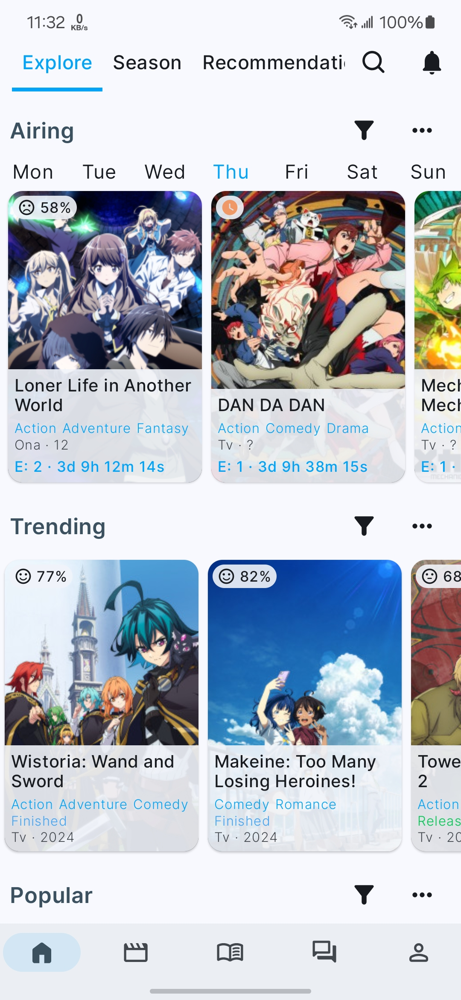
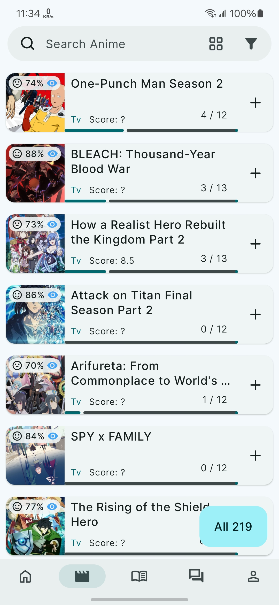
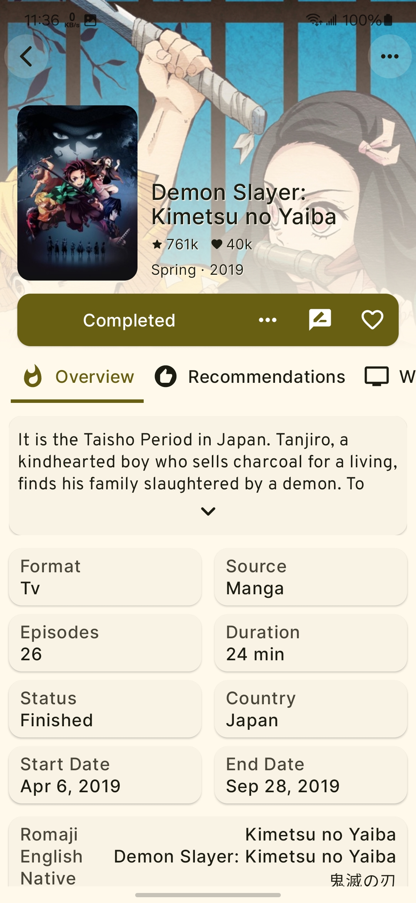

# AniLib [App](https://anilibapp.github.io)

### An Unofficial Client for [AniList](https://anilist.co)
Track your anime and manga progress, discover new titles, customize your lists, and much more—all in one app!

<table>
    <tr>
    <td align="center">
           
    </td>
    <td align="center">
        
    </td>
    </tr>
</table>

## Features

    
- Track anime and manga progress.
- Get detailed info on characters, episodes, and studios.
- Use advanced filters to quickly find anime and manga that match your tastes.
- Discover recommendations based on the media you're viewing.
- Create custom lists with your own rating systems.
- Share lists and reviews with friends.
- Discover various stats based on your media preferences.
- Enjoy theme customization.
- Get notified about new episodes.
- and much more...

## License

<pre>
Copyright 2020 Pushwant Rai

Licensed under the Apache License, Version 2.0 (the "License");
you may not use this file except in compliance with the License.
You may obtain a copy of the License at

http://www.apache.org/licenses/LICENSE-2.0

Unless required by applicable law or agreed to in writing, software
distributed under the License is distributed on an "AS IS" BASIS,
WITHOUT WARRANTIES OR CONDITIONS OF ANY KIND, either express or implied.
See the License for the specific language governing permissions and
limitations under the License.
</pre>

