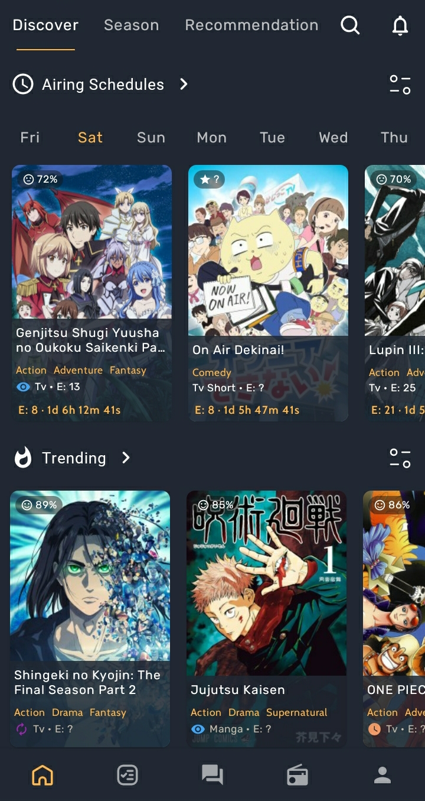
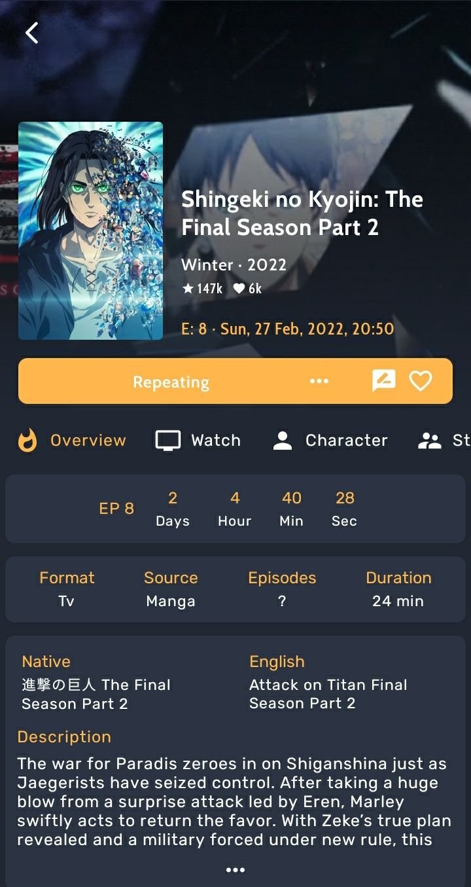
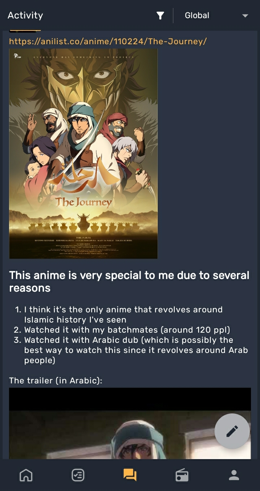
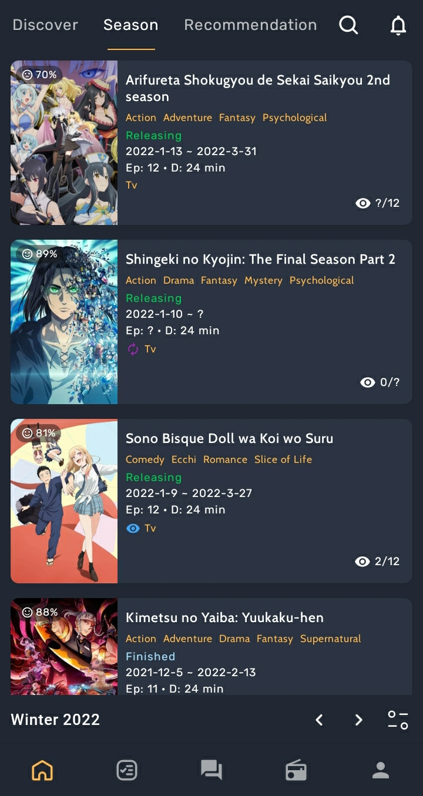
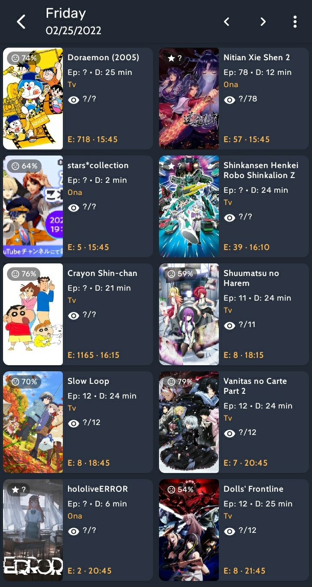

        

<h1 align="center">AniLib (Unofficial app for AniList)</h1>

<h2 align="center">Track, share and discover your favorite anime and manga all in one place with the power of <a href="https://anilist.co/">AniList</h2>
        

        

        
        
        
        
        
        
        

        
<h2 align="center">Links</h2>

        

## Translation
        
### Many thanks to the translators who make AniLib available to everyone
        

| Languaje | Translator |
| --- | --- |
| Arabic | Sakugaky, Mimogu |
| French | natsuthelight |
| German | [André Niebuhr (Epr0m)](https://anilist.co/user/Epr0m/) |
| Hindi | Manoj Chetry (KcMj) |
| Italian | Yoshimitsu, cayzon |
| Portuguese | Satoru, SamOak |
| Russian | Natalie |
| Spanish | ricardoric_03, [MrJako2001](https://anilist.co/user/MrJaco/) |

## Want to help translate AniLib into your language?
        
First request to join your language group at [POEditor](https://poeditor.com/join/project?hash=d9NRHxgZSb), then send an email to anilib.dev@gmail.com to approve your request.
                                                                                                                  
## Development

Api Keys

        
Supply AniList Api Keys into `secret.properties`.

Rename file `example.secret.properties` to `secret.properties` and add properties as required in root project folder.
 

Contributions

        
* Always create pull request to master branch. 
* Please pull to latest before sending pull request to avoid merge conflict. 
* Create description about what it does or solve. 

## Issues
Before creating an issue check if it is already opened. 

Bugs

        
* Check if bug is already fixed. 
* Create an issue with steps to reproduce the bug and a screenshot would help.
* Report/Discuss about the issue in chat if you are unsure about it. 

## Support
If you like this weeb's project, feel free to contribute through [Buymeacoffee](https://www.buymeacoffee.com/9qP65KlG4) or [PayPal](https://paypal.me/rev0lgenX?locale.x=en_US)    
        
## License

    Copyright 2020 Pushwant Rai
    
    Licensed under the Apache License, Version 2.0 (the "License");
    you may not use this file except in compliance with the License.
    You may obtain a copy of the License at
    
    http://www.apache.org/licenses/LICENSE-2.0
    
    Unless required by applicable law or agreed to in writing, software
    distributed under the License is distributed on an "AS IS" BASIS,
    WITHOUT WARRANTIES OR CONDITIONS OF ANY KIND, either express or implied.
    See the License for the specific language governing permissions and
    limitations under the License.
